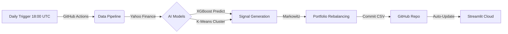

# 📊 AlphaEdge: CAC40 ML-Powered Portfolio Manager

> **Master 2 - Statistics Expertise for Finance & Economics | Université de Lorraine**
> Advanced quantitative analysis combining Machine Learning (XGBoost), Unsupervised Learning (K-Means), and Modern Portfolio Theory for automated asset allocation.

[](https://cac40-smart-portfolio-asset.streamlit.app/)
[]()
[]()
[](https://www.python.org/)
[](LICENSE)

---

## 🎯 Project Overview

**AlphaEdge** is an intelligent, fully automated portfolio management system designed to outperform the CAC40 index. It eliminates human bias by combining three rigorous layers of analysis:

1.  **Market Regime Detection (K-Means):** Identifies behavioral clusters (Momentum, Value, Defensive).
2.  **Directional Prediction (XGBoost):** Probabilistic forecasting of 1-month future returns.
3.  **Risk Optimization (Markowitz/MPT):** Maximizes the Sharpe Ratio via Efficient Frontier allocation.

### 🔗 [Click here to access the Live Dashboard](https://cac40-smart-portfolio-asset.streamlit.app/)

---

## ⚡ MLOps & Automation Architecture

Unlike static notebooks, this project lives in the cloud. The pipeline is fully **Serverless**:


---

## 🛠️ Installation & Local Usage

If you want to run the model locally instead of using the cloud app:
```bash
# 1. Clone the repository
git clone https://github.com/SORADATA/CAC40-Quantitative-Analysis-Predictive-Asset-Allocation.git

# 2. Install dependencies
pip install -r requirements.txt

# 3. Run the Streamlit Dashboard
streamlit run app.py

# 4. (Optional) Force a model update
python daily_run.py
```

---

## 📂 Project Structure

* `app.py`: The frontend application (Streamlit).
* `daily_run.py`: The ETL & Inference script run by GitHub Actions.
* `notebooks/`: Research and Training notebooks (EDA, Model Training).
* `src/models/`: Serialized models (`xgboost_model.pkl`, `kmeans_model.pkl`).
* `.github/workflows/`: CI/CD configuration.

---

> **Disclaimer:** This project is for educational and research purposes only. It does not constitute financial advice. Past performance is not indicative of future results.