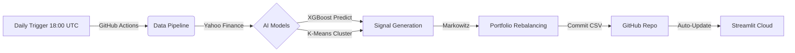

# 📊 AlphaEdge: CAC40 ML-Powered Portfolio Manager

> **Master 2 - Statistics Expertise for Finance & Economics | Université de Lorraine**
> Advanced quantitative analysis combining Machine Learning (XGBoost), Unsupervised Learning (K-Means), and Modern Portfolio Theory for automated asset allocation.

[](https://cac40-smart-portfolio-asset.streamlit.app/)
[]()
[]()
[](https://www.python.org/)


---

## 🎯 Project Overview
**AlphaEdge** est un système automatisé de gestion de portefeuille pour le CAC40, combinant :
- **Détection de régimes de marché** (K-Means)
- **Prédiction directionnelle** (XGBoost)
- **Optimisation de risque** (Markowitz)
- **Exécution serverless** (GitHub Actions + Streamlit)
 
📈 **Résultats** : Surperformance du CAC40 grâce à une allocation dynamique et data-driven.


### 🔗 [Click here to access the Live Dashboard](https://cac40-smart-portfolio-asset.streamlit.app/)

---

## ⚡ MLOps & Automation Architecture

Unlike static notebooks, this project lives in the cloud. The pipeline is fully **Serverless**:

## 📊 Example Output
| Ticker  | Cluster | Proba_Hausse | Allocation | Signal  |
|---------|---------|--------------|------------|---------|
| LVMH.PA | 3       | 0.78         | 0.15       | ACHAT   |
| TOT.PA  | 1       | 0.45         | 0.00       | NEUTRE  |
---

## 🚀 Quick Start
```bash
# Clone the repo
git clone https://github.com/SORADATA/CAC40-Quantitative-Analysis-Predictive-Asset-Allocation.git
cd CAC40-Quantitative-Analysis-Predictive-Asset-Allocation
 
# Install dependencies
pip install -r requirements.txt
 
# Run the dashboard
streamlit run app.py
 
# (Optional) Run the pipeline manually
python daily_run.py

---

## 📂 Project Structure

* `app.py`: The frontend application (Streamlit).
* `daily_run.py`: The ETL & Inference script run by GitHub Actions.
* `notebooks/`: Research and Training notebooks (EDA, Model Training).
* `src/models/`: Serialized models (`xgboost_model.pkl`, `kmeans_model.pkl`).
* `.github/workflows/`: CI/CD configuration.

---

> **Disclaimer:** This project is for educational and research purposes only. It does not constitute financial advice. Past performance is not indicative of future results.
