<div align="center">

# 📈 AlphaEdge: AI-Powered CAC40 Portfolio Manager

**Production-Ready Quantitative Trading System with Daily MLOps Pipeline**

Combining Unsupervised Learning, XGBoost & Modern Portfolio Theory for Automated Asset Allocation

[](https://www.python.org/downloads/)
[](https://cac40-smart-portfolio-asset.streamlit.app/)
[](https://opensource.org/licenses/MIT)
[](https://github.com/psf/black)
[](https://github.com/SORADATA/CAC40-Quantitative-Analysis-Predictive-Asset-Allocation/graphs/commit-activity)

[🌐 **Live Dashboard**](https://cac40-smart-portfolio-asset.streamlit.app/) • [📊 **View Results**](#-performance-metrics) • [🚀 **Quick Start**](#-quick-start) • [🐛 **Report Issue**](https://github.com/SORADATA/CAC40-Quantitative-Analysis-Predictive-Asset-Allocation/issues)

</div>

---

## 🎯 Why AlphaEdge?

Traditional portfolio management relies on static allocations and reactive rebalancing. **AlphaEdge** flips this paradigm by implementing a **fully automated, AI-driven investment strategy** that:

- 🔄 **Rebalances daily** based on market regime detection and predictive signals
- 🤖 **Requires zero manual intervention** through GitHub Actions automation
- 📈 **Adapts to market conditions** using unsupervised learning for regime classification
- ⚡ **Responds to signals in real-time** with optimized portfolio weights
- 🎓 **Built on academic rigor** from quantitative finance research

> **Perfect for:** Quantitative researchers, algo traders, data scientists, and finance students looking to deploy production-grade ML strategies.

---

## 🌟 Key Features

### 🧠 Hybrid AI Architecture
- **Market Regime Detection:** K-Means clustering identifies bullish, bearish, and neutral market states
- **Directional Forecasting:** XGBoost predicts next-day returns with probability scores
- **Ensemble Strategy:** Combines both models for robust signal generation

### ⚖️ Advanced Portfolio Optimization
- **Markowitz Mean-Variance Framework** with Ledoit-Wolf covariance shrinkage
- **Dynamic risk constraints** adjusted by market volatility
- **Transaction cost modeling** to minimize portfolio turnover

### ☁️ Production-Grade MLOps
- **Automated daily ETL** via GitHub Actions (no servers needed)
- **Version-controlled models** with reproducible training pipeline
- **Monitoring & alerting** through Streamlit dashboard
- **Scalable architecture** ready for multi-asset expansion

### 📊 Interactive Analytics
- Real-time performance tracking vs CAC40 benchmark
- Signal visualization with confidence intervals
- Drawdown analysis and risk metrics
- Portfolio composition timeline

---

## 📸 Dashboard Preview

<div align="center">

| **Portfolio Performance** | **AI Trading Signals** |
|:---:|:---:|
|  |  |

*Live tracking of cumulative returns, Sharpe ratio, and maximum drawdown (left). Daily probabilistic forecasts with market regime indicators (right).*

</div>

---
## 📊 Performance Metrics (Live & Backtest)

Data updated as of: **2026-02-05**

| Metric | AlphaEdge Strategy 🤖 | CAC40 Benchmark 🇫🇷 |
| :--- | :---: | :---: |
| **Total Return** | **+121.9%** 🚀 | +87.9% |
| **Alpha (vs Bench)** | **+34.0%** | N/A |
| **YTD Performance** | **+9.5%** | TBD |
| **Sharpe Ratio** | **0.63** | N/A |
| **Max Drawdown** | **-32.0%** | TBD |

> **Note:** The strategy has shown significant outperformance in the recent period (2024-2026), successfully identifying market regime shifts.

*Metrics updated daily. View real-time performance on the [live dashboard](https://cac40-smart-portfolio-asset.streamlit.app/).*

---

## 🏗️ System Architecture

The entire pipeline runs autonomously with zero maintenance required.

```mermaid
graph TB
    A[🌐 Yahoo Finance API] -->|Daily at Market Close| B[Data Ingestion]
    B --> C[Feature Engineering]
    C --> D{AI Model Ensemble}
    D -->|Regime Detection| E[K-Means Clustering]
    D -->|Return Prediction| F[XGBoost Classifier]
    E & F --> G[Signal Aggregation]
    G --> H[Portfolio Optimization]
    H -->|Markowitz + Constraints| I[Weight Allocation]
    I --> J[📁 Export Results]
    J --> K[📊 Streamlit Dashboard]
    J --> L[📈 Backtest Analysis]
    
    style A fill:#e1f5ff
    style D fill:#fff4e1
    style H fill:#ffe1f5
    style K fill:#e1ffe1
```



### Pipeline Components

1. **Data Layer:** Real-time market data from Yahoo Finance API
2. **Feature Store:** Technical indicators (RSI, MACD, Bollinger Bands) + macro factors
3. **ML Models:** Pre-trained and versioned in `/src/models/`
4. **Optimization Engine:** PyPortfolioOpt with custom risk models
5. **Deployment:** GitHub Actions + Streamlit Cloud (serverless)

---

## 🚀 Quick Start

### Prerequisites

- Python 3.10 or higher
- Git installed
- (Optional) Virtual environment tool

### Installation

```bash
# Clone the repository
git clone https://github.com/SORADATA/CAC40-Quantitative-Analysis-Predictive-Asset-Allocation.git
cd CAC40-Quantitative-Analysis-Predictive-Asset-Allocation

# Create virtual environment (recommended)
python -m venv venv
source venv/bin/activate  # On Windows: venv\Scripts\activate

# Install dependencies
pip install -r requirements.txt
```

### Running Locally

**Option 1: Launch Dashboard**
```bash
streamlit run app.py
```
Opens interactive dashboard at `http://localhost:8501`

**Option 2: Run Pipeline Manually**
```bash
python daily_run.py
```
Executes full ETL, prediction, and optimization cycle

**Option 3: Explore Notebooks**
```bash
jupyter notebook notebooks/
```
Access research notebooks for model training and backtesting

---

## 📂 Project Structure

```
CAC40-Quantitative-Analysis-Predictive-Asset-Allocation/
├── .github/
│   └── workflows/
│       └── daily_pipeline.yml       # Automated daily execution
├── data/
│   ├── raw/                         # Historical price data
│   ├── processed/                   # Feature-engineered datasets
│   └── results/                     # Portfolio weights & signals
├── images/                          # Screenshots & visualizations
├── notebooks/
│   ├── 01_EDA.ipynb                 # Exploratory data analysis
│   ├── 02_Model_Training.ipynb      # ML model development
│   └── 03_Backtesting.ipynb         # Strategy validation
├── src/
│   ├── models/
│   │   ├── xgboost_model.pkl        # Trained predictor
│   │   └── kmeans_model.pkl         # Regime classifier
│   ├── utils/
│   │   ├── data_loader.py           # ETL functions
│   │   ├── feature_engineering.py   # Indicator calculations
│   │   ├── optimization.py          # Portfolio allocation
│   │   └── evaluation.py            # Performance metrics
│   └── config.py                    # Centralized configuration
├── app.py                           # Streamlit dashboard
├── daily_run.py                     # Main pipeline orchestrator
├── requirements.txt                 # Python dependencies
├── LICENSE                          # MIT License
└── README.md                        # You are here!
```

---

## 🔧 Customization Guide

### Adapting to Other Markets

Want to apply this strategy to S&P 500, FTSE 100, or cryptocurrencies?

1. **Fork this repository** (click the Fork button above)

2. **Modify the ticker list** in `src/config.py`:
```python
# Example: Switch to S&P 500
TICKERS = ['AAPL', 'MSFT', 'GOOGL', 'AMZN', 'NVDA', ...]
BENCHMARK = '^GSPC'  # S&P 500 index
```

3. **Retrain models** (optional but recommended):
```bash
python notebooks/02_Model_Training.ipynb
```

4. **Push changes** and the automated pipeline handles the rest!

### Tuning Parameters

Key configuration options in `src/config.py`:

| Parameter | Description | Default |
|-----------|-------------|---------|
| `LOOKBACK_PERIOD` | Historical window for features | 252 days |
| `N_CLUSTERS` | Market regimes for K-Means | 3 |
| `RISK_AVERSION` | Portfolio risk tolerance | 2.5 |
| `MAX_WEIGHT` | Position size limit per asset | 0.15 |
| `REBALANCE_THRESHOLD` | Trigger for portfolio adjustment | 5% |

---

## 📚 Technical Deep Dive

### Feature Engineering

The model uses 50+ features across multiple categories:

- **Price-based:** Returns (1d, 5d, 20d), log-returns, price ratios
- **Technical Indicators:** RSI, MACD, Bollinger Bands, ATR, Stochastic Oscillator
- **Volume Metrics:** OBV, Volume MA ratios, VWAP
- **Volatility Measures:** Historical vol, Parkinson estimator, Garman-Klass
- **Market Microstructure:** Bid-ask spread proxies, Amihud illiquidity

### Model Training

**XGBoost Classifier:**
- Binary classification (up/down next day)
- Custom weighted loss function (asymmetric)
- 5-fold time-series cross-validation
- Hyperparameter tuning via Optuna

**K-Means Clustering:**
- Applied to 10 macro features (volatility, momentum, correlation)
- Elbow method + Silhouette score for optimal K
- Regime labels: Bull (0), Neutral (1), Bear (2)

### Portfolio Optimization

Implements **Markowitz Mean-Variance Optimization** with:
- Expected returns via **exponentially weighted moving average** (EWMA)
- Covariance matrix via **Ledoit-Wolf shrinkage** (addresses estimation error)
- Constraints: Long-only, box constraints, sector limits
- Objective: Maximize Sharpe ratio with L2 regularization

---

## 🤝 Contributing

Contributions are welcome! Here's how you can help:

1. **Report bugs** via [GitHub Issues](https://github.com/SORADATA/CAC40-Quantitative-Analysis-Predictive-Asset-Allocation/issues)
2. **Suggest features** in the Discussions tab
3. **Submit pull requests** following the code style guidelines

### Development Setup

```bash
# Install development dependencies
pip install -r requirements-dev.txt

# Run linting
black src/ --check
flake8 src/

# Run tests
pytest tests/
```

---

## 📖 Research & References

This project builds upon:

- Markowitz, H. (1952). "Portfolio Selection". *Journal of Finance*
- Friedman, J. et al. (2001). "Greedy Function Approximation: A Gradient Boosting Machine"
- Ledoit, O. & Wolf, M. (2004). "Honey, I Shrunk the Sample Covariance Matrix"
- Bailey, D. et al. (2017). "Stock Portfolio Design and Backtest Overfitting". *Journal of Investment Management*


---

## ⚠️ Disclaimer

**This project is for educational and research purposes only.**

- ❌ Not financial advice or investment recommendations
- ❌ No guarantee of profitability or performance
- ❌ Past results do not predict future outcomes
- ⚠️ Algorithmic trading involves substantial risk of capital loss 

Always consult with a licensed financial advisor before making investment decisions.

---

## 📜 License

This project is licensed under the **MIT License** - see the [LICENSE](LICENSE) file for details.

You are free to use, modify, and distribute this code with attribution.

---

## 🙏 Acknowledgments

Developed as part of the **Master 2 - Statistics Expertise for Finance & Economics** program at **Université de Lorraine**.

Special thanks to:
- Professor [Name] for guidance on quantitative methods
- The open-source community for libraries (Streamlit, scikit-learn, PyPortfolioOpt)
- CAC40 companies for providing publicly available data

---

<div align="center">

### 💡 Found this useful?

⭐ **Star this repo** to show support!

🔀 **Fork it** to build your own strategy!

📢 **Share it** with fellow quants and developers!

---

**Developed by [SORADATA](https://github.com/SORADATA)**

*Master 2 Statistics & Econometrics | Université de Lorraine*

[](https://github.com/SORADATA)
[](https://twitter.com/SORADATA)

</div>
